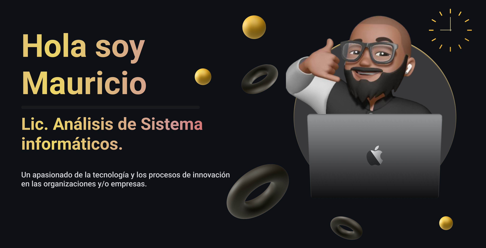

# Algo sobre mi

Ayudo a las empresas a alcanzar su máximo nivel en sus departamentos de tecnología y a optimizar sus costos a través de análisis de aplicaciones de negocio, procedimientos y experiencias del usuario, además de la optimización de las arquitecturas tecnológicas e infraestructuras del negocio.

Cuento con +10 años de experiencia optimizando departamentos de tecnologías y gestionando proyectos con metodologías tradicionales y ágiles en equipos de hasta 15 personas a mi cargo.

# Otros Conocimientos de interés:
Ademas me he capacitado pudiendo ayudar en las distintas areas de negocio como:
* Marketing Digital.
* Inteligencia del negocio.
* Normativas ISO 9001 y 27001.
* Estándares de servicios según ITIL.
* Arquitecturas de aplicaciones.
